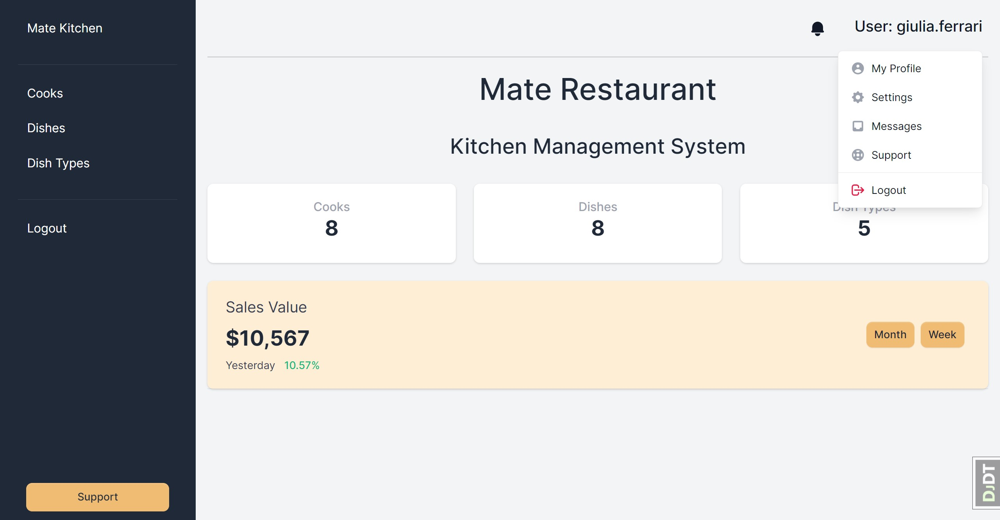

# Restaurant Kitchen Management System 

Project for managing restaurant kitchen with cooks dishes and types of dishes

## Check it out!

[Project deployed on Render](PAST_LINK_HERE)

## Installation

Python3 must be already installed

```shell
git clone https://github.com/ochernous/restaurant-kitchen-managment
python -m venv venv
venv\Scripts\activate (on Windows)
source venv/bin/activate (on macOS)
pip install -r requirements.txt
python manage.py migrate
python manage.py runserver
```
Use the following command to load prepared data from fixture:
```shell
python manage.py loaddata restaurant_kitchen_db_data.json
```
After loading data from fixture you can use following superuser (or create another one by yourself):

Login:```admin.user```

Password:```18OeMrVrAs```

## Description
This project is designed to improve communication and establish rules among cooks in the kitchen. It allows cooks to 
create new dishes and dish types, as well as specify which cooks are responsible for cooking each dish.
Cooks can also register new cooks in the system.

## Functionality
- Creation of new dishes
- Creation of new dish types
- Registration of new cooks
- Specification of responsible chefs for each dish


